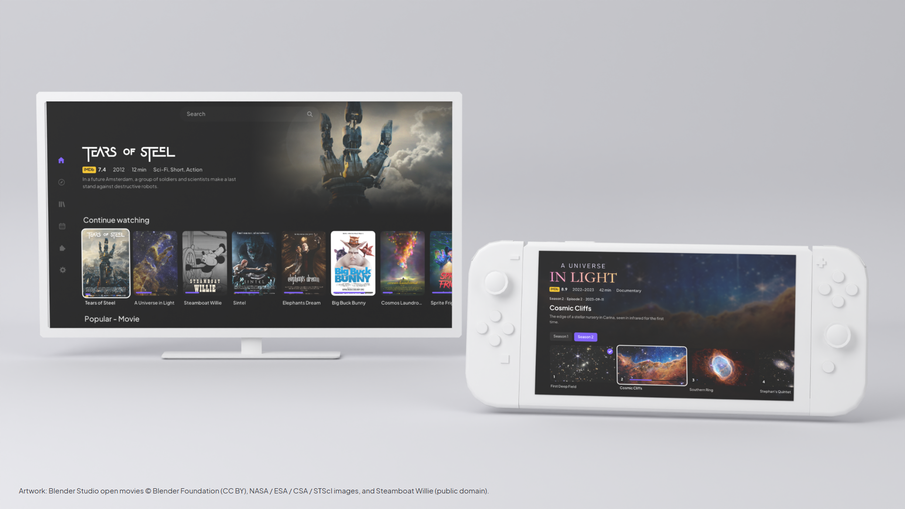
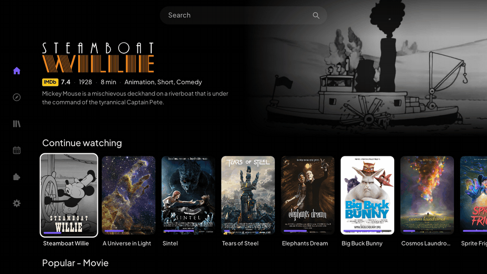
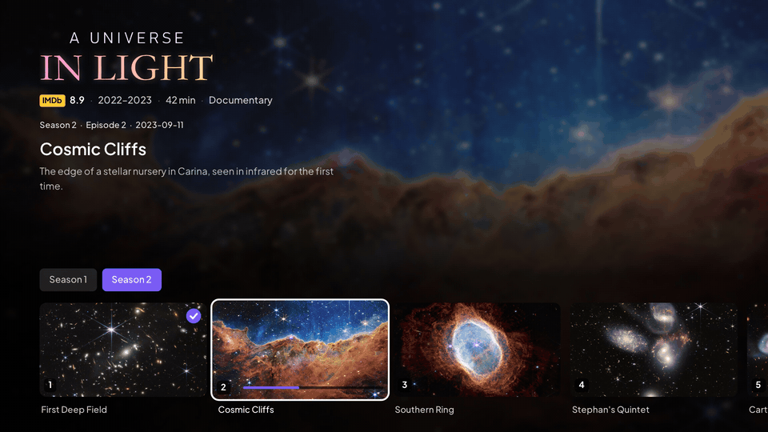
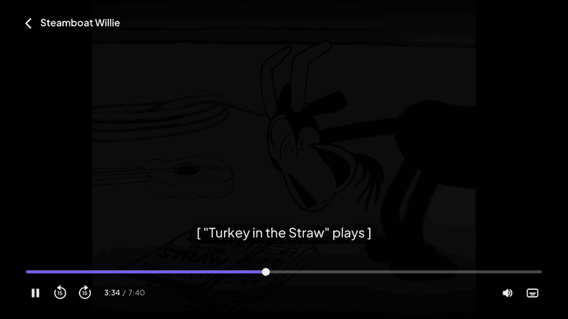
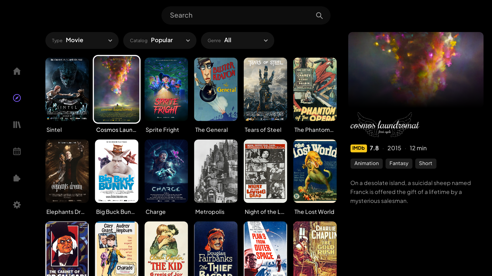
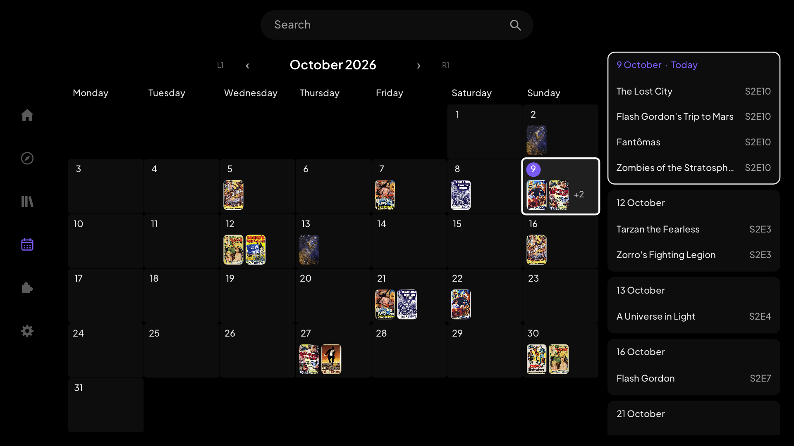
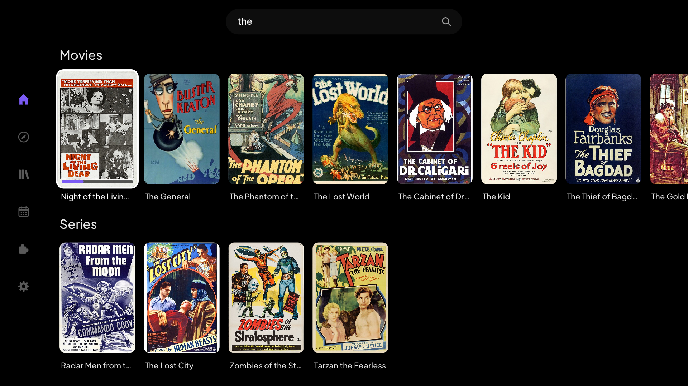

  

  &nbsp;
  &nbsp;
  &nbsp;
  

  <picture>
    <source media="(prefers-color-scheme: dark)" srcset="docs/images/stremibrew-dark.png">
    
  </picture>

<h3 align="center">Cross-Platform Unofficial Stremio Client</h3>

StremiBrew is a cross-platform, third-party Stremio client that aims to bring the native Stremio TV experience to consoles and builds on it with features only console hardware can handle.

The UI is inspired by my favourite elements of Stremio's official web-based TV interface and its Android TV app.

It currently supports the **PS5** and **Switch**, with features including:

- Stremio account sign-in with a link code, with your library, add-ons and watch progress synced through the official `stremio-core`
- Trailers that play automatically on the home screen as you move between titles (PS5)
- Home board, Discover, Library, Calendar, Add-ons and search with the console's on-screen keyboard
- Title pages with seasons, episodes and stream lists, for HTTP streams
- Player with seeking, scrubber previews, audio track selection, embedded and add-on subtitles with delay and styling, and resume
- An animated UI, with transitions between screens and optional sound effects
- 4K output and HDR-to-SDR tone mapping (PS5)
- Experimental subtitle auto-calibration, which times add-on subtitles to the dialogue using on-device speech recognition (PS5)
- A handheld UI that switches on automatically when undocked, and a stream quality limit (Switch)

PS4 and Wii U support is planned in the near future.

## Demonstration

  
  

  
  

  
  

## Credits and disclaimers

### Credits

- **[Stremio](https://www.stremio.com/)**: StremiBrew is a client for Stremio and would not exist without it. Accounts, the library, add-ons, catalogs and watch progress are all handled by Stremio's own open-source [`stremio-core`](https://github.com/Stremio/stremio-core), used under its MIT license. The interface takes after Stremio's web-based TV interface and its Android TV app.
- **[borealis](https://github.com/natinusala/borealis)** by natinusala, and **[xfangfang's fork of borealis](https://github.com/xfangfang/borealis)**: StremiBrew's interface is drawn with the NanoVG renderer kept in that fork. It is what lets the UI render natively on each console, smoothly and responsively, with no web view in between.
- **[NanoVG](https://github.com/memononen/nanovg)** by Mikko Mononen, and **[FFmpeg](https://ffmpeg.org/)**, which plays the video.
- The 3D models in the picture at the top of this page are credited in [docs/images/CREDITS.md](docs/images/CREDITS.md).

### Support Stremio

All contributions and support should go to the Stremio team, whose work this is built on. I do not, and will never accept donations for this project.

- [Become a Stremio supporter](https://www.stremio.com/plans)
- [Contribute to `stremio-core`](https://github.com/Stremio/stremio-core)

### Disclaimers

- **Unofficial**: StremiBrew is a third-party project. It is not affiliated with, endorsed by or supported by Stremio, Sony Interactive Entertainment or Nintendo. All names, logos and trademarks belong to their owners. Please do not ask the Stremio team for help with it.
- **No content**: StremiBrew does not host, provide, index or link to any film, series or other media, and includes no third-party add-ons. It only shows what the add-ons on your own Stremio account return. What you install and what you watch are your responsibility, and so is following the law where you live.
- **Torrents are not supported**: StremiBrew has no torrent client, and at this period of time I do not plan to add one. Torrent and magnet streams cannot be played and are marked as such; only direct HTTP and HTTPS streams play.
- **Artwork**: Posters, logos and stills in the screenshots above belong to their owners and are shown only to demonstrate the app.
- **Homebrew**: StremiBrew runs only on consoles that can already run homebrew. It contains no code from Sony or Nintendo and does nothing to enable piracy of games. Use it at your own risk: it comes with no warranty, as set out in the [license](LICENSE.md).
